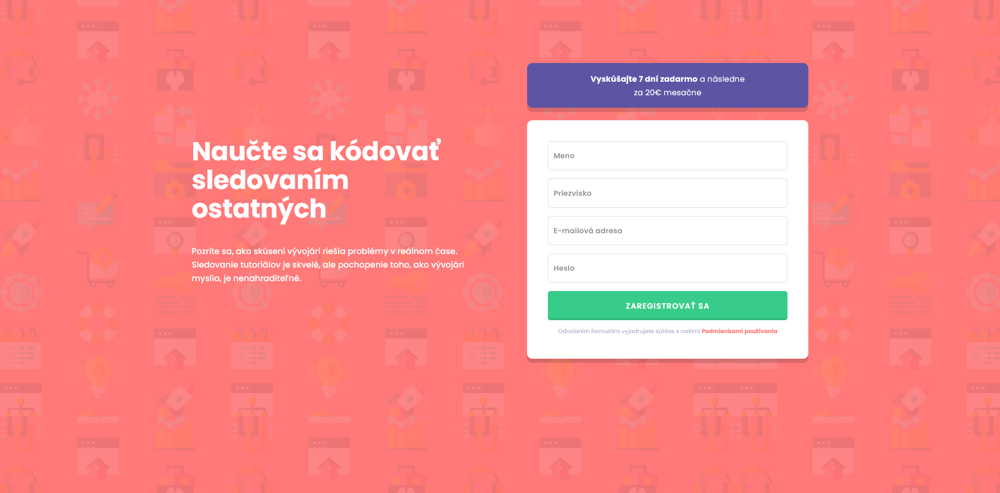
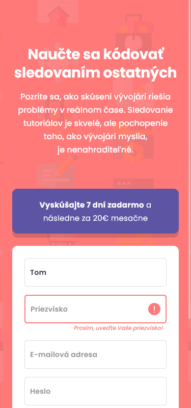

# Frontend Mentor - Intro component with sign-up form

## 📝 Informácie o projekte

Tento projekt je zo stránky [Frontend Mentor](https://www.frontendmentor.io/challenges/intro-component-with-signup-form-5cf91bd49edda32581d28fd1). Stránka Frontend Mentor ponúka projekty na vypracovanie, ktoré obsahujú základný text v HTML a grafický dizajn projektu. Predlohy projektov sú dostupné vo Figme.

Projekt je responzívna landing page, kde sa nachádzajú interaktívne prvky. Pri odoslaní formulára sa zobrazia chybné hlásenia, ak je formulár prázdny alebo ak má e-mailová adresa nesprávny formát.

Po kliknutí na fialový obdĺžnik sa zobrazí môj predchádzajúci projekt zo stránky [Frontend Mentor](https://www.frontendmentor.io/solutions/my-version-base-apparel-coming-soon-page-ni6OmD0IKN).

#### [Odkaz na hotovú stránku](https://tomasdunik.github.io/intro-component-with-sign-up-form/)

 

## 🏗️ Vytvorenie projektu

Pri vytváraní projekt som strávil najviac času s JavaScriptom, ktorý sa učím. Kód v JavaScripte pre validáciu formulára som napísal ja. Druhý kód v JavaScripte je na zmenu farby okrajov inputov, keď sa na ne klikne. Ten som vytvoril s pomocou ChatGPT. Veľa času som strávil aj vytváraním responzívneho dizajnu. V SCSS som využil funkciu na prevod _px_ na _em_ a _line height_. Vytvorenie tejto stránky mi trvalo približne 8 hodín.

 

## 🏫 Čo som sa naučil

Naučil som sa lepšie pracovať s formulárom a jeho spojením s JavaScriptom.

 

## 🛠️ Vytvorené s

- HTML
- CSS
- SCSS
- JavaScript
- Mobile First
- ChatGPT

 

## 🧭 Užitočné odkazy

- [ChatGPT](https://chat.openai.com/)

 

## 📸 Screenshots

### 💻 Desktop

### 📱 Tablet

### 📱 Mobil

 

## 🔗 Projekty Frontend Mentor

- [Tento konkrétny projekt na stránke Frontend Mentor](https://www.frontendmentor.io/solutions/my-version-intro-component-with-signup-form-mGaz1ESb-k)
- [Moje ostatné projekty na stránke Frontend Mentor](https://www.frontendmentor.io/profile/WeekendsProgrammer)
